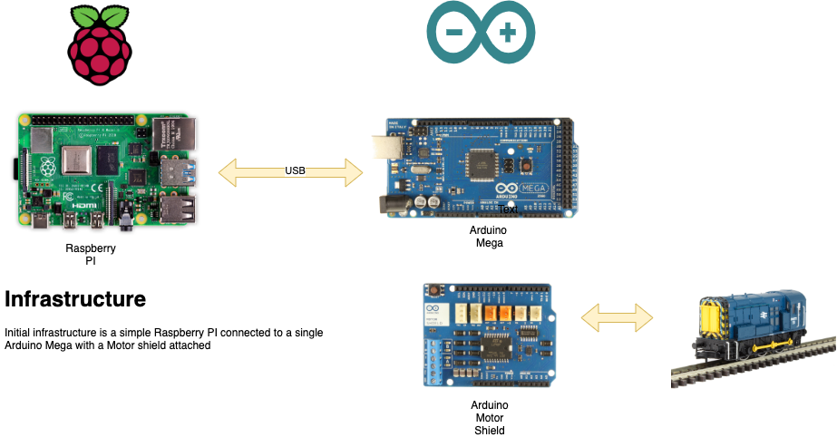

# Basic Components

## Hardware
The basic three components consist of a Raspberry PI, Arduino Mega and a Arduino Motor shield. 

### Raspberry PI
Raspberry Pi 4 Model B 4GB Quad Core 64 Bit Cortex-A72 4x USB WiFi Bluetooth 5 (4GB)
Cost about £55

### Arduino Mega or compatible
Arduino ATmega2560 ATMEGA16U2 with USB Cable Blue Version
Cost about £15

### Arduino Motor Shield
Arduino Motor Shield Rev3
Cost about £22

